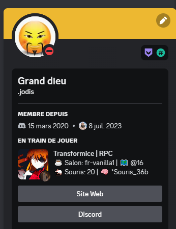

<br/><br/>
<div align="center"> 
  
</div>
<br/><br/>

<div align="center">
  
[](https://www.youtube.com/@Jodis974)
[](https://safemarket.xyz/discord)
[](mailto:support-checkout@safemarket.xyz)
[](https://safemarket.xyz/)

</div>


Update: 


# Transformice-Discord-Rich-Presence
Safemarket License

- 🌐 Website: [safemarket.xyz](https://safemarket.xyz)
- 💬 Discord: [safemarket.xyz/discord](https://safemarket.xyz/discord)
- 📧 Email: support-checkout@safemarket.xyz

---


### D1


### D2


### D3


### D4


---

[](https://github.com/Jodis974/Transformice-Discord-Rich-Presence/assets/132891555/f9b7ca6b-dea6-42d0-ad38-6af2d5dc2c6c)


### Find IP Transformice

1. Download recent transformice swf
2. Open CMD with the swf in the actual folder then type decript.exe Transformice.swf
3. Type swfdump.exe -a Transformice_decripted.swf > txf.txt
4. py ip.py then you get someting like that : 
```python
Ligne 18813: 00067) + 1:2 pushstring "51.77.132.45:11801-12801-13801-14801" (IP: 51.77.132.45)
Ligne 88124: 00262) + 1:1 pushstring "192.168.0.112" (IP: 192.168.0.112)
Ligne 88540: slot 76: var <q>[public]::\6\8\3\5\3\6\5\3\8\5\4:<q>[public]::String = 192.168.0.112 (IP: 192.168.0.112)
Ligne 127072: 00585) + 1:1 pushstring "127.0.0.1:11801" (IP: 127.0.0.1)
Ligne 127369: slot 169: var <q>[public]::\8\2\6\4\1\7\8\8\6\1\7:<q>[public]::String = 127.0.0.1:11801 (IP: 127.0.0.1)
Ligne 128272: 00727) + 1:1 pushstring "http://192.168.0.1/deadmeat" (IP: 192.168.0.1)
Ligne 128628: slot 199: var <q>[public]::\8\6\4\3\2\3\7\5\7\5\6:<q>[public]::String = http://192.168.0.1/deadmeat (IP: 192.168.0.1)
Ligne 132494: 00266) + 1:1 pushstring "127.0.0.1" (IP: 127.0.0.1)
Ligne 132983: slot 74: var <q>[public]::\1\8\8\7\7\7\4\7\8\6\4\8:<q>[public]::String = 127.0.0.1 (IP: 127.0.0.1)
Ligne 191386: 00653) + 1:1 pushstring "192.168.0.1" (IP: 192.168.0.1)
Ligne 191684: slot 189: var <q>[public]::\8\3\4\4\4\2\8\6\8\5\5:<q>[public]::String = 192.168.0.1 (IP: 192.168.0.1)
Ligne 216130: 00622) + 1:1 pushstring "5.196.91.193" (IP: 5.196.91.193)
Ligne 216133: 00625) + 1:1 pushstring "68.219.177.109" (IP: 68.219.177.109)
Ligne 216432: slot 178: var <q>[public]::\5\1\1\8\7\8\8\7\5\8\7\4\8:<q>[public]::String = 5.196.91.193 (IP: 5.196.91.193)
Ligne 216433: slot 179: var <q>[public]::\3\5\8\7\7\4\8\5\1\1\4:<q>[public]::String = 68.219.177.109 (IP: 68.219.177.109)
Ligne 285180: 00003) + 1:1 pushstring "4.11.0.0" (IP: 4.11.0.0)
Ligne 285185: slot 1: const <q>[namespace]http://www.adobe.com/2006/flex/mx/internal::VERSION:<q>[public]::String = 4.11.0.0 (IP: 4.11.0.0)
Ligne 285224: 00003) + 1:1 pushstring "4.11.0.0" (IP: 4.11.0.0)
Ligne 285229: slot 1: const <q>[namespace]http://www.adobe.com/2006/flex/mx/internal::VERSION:<q>[public]::String = 4.11.0.0 (IP: 4.11.0.0)
```

then use this ip : ```Ligne 18813: 00067) + 1:2 pushstring "51.77.132.45:11801-12801-13801-14801" (IP: 51.77.132.45)```
